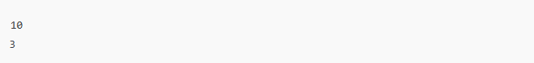
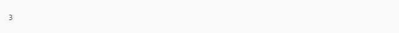
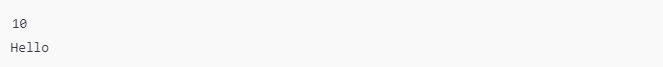
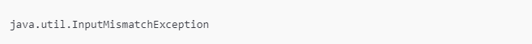

# Manipulacao de excecoes em Java

O exercício trata de manipulação de exceções em Java com o uso de blocos try-catch. O objetivo é testar sua capacidade de tratar erros durante a execução de um código.

Você deve receber dois números inteiros como entrada e calcular o resultado da divisão entre eles. Caso algum dos números não seja um inteiro de 32 bits ou se o divisor for zero, ocorrerá uma exceção que deverá ser reportada.

### Exemplos de Entrada/Saída:

* Entrada 0:\
  

  Saída 0:\
    

* Entrada 1:\
    

   Saída 1:\
      

